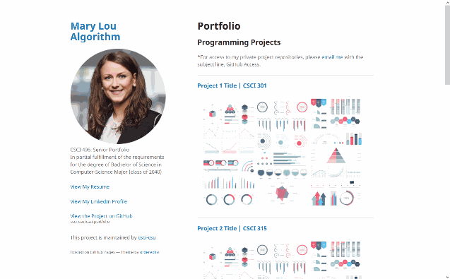

Senior Portfolio Template for CSCI 496
======================================

## Introduction

Use this template to create your senior portfolio using GitHub Pages!



## Installation

1.  Log in to GitHub (create a [GitHub profile](https://github.com/join) if you don't already have one).
2.  Navigate to https://github.com/csu-cs/csci-portfolio
3.  Click on the "Fork" button in the top right corner.
4.  Follow the rest of [this step-by-step tutorial on Medium](https://medium.com/@evanca/set-up-your-portfolio-website-in-less-than-10-minutes-with-github-pages-d0efa8ff56fd). This senior portfolio repository was originally forked from  [quick-portfolio by Ivanna Kacewica](https://github.com/evanca/quick-portfolio) for which the tutorial was originally written.

[A Video Tutorial](https://youtu.be/ECtcGftiCBI)

___

You can use the editor on GitHub to maintain and preview the content for your website in Markdown files.

Whenever you commit to this repository, GitHub Pages will run [Jekyll](https://jekyllrb.com/) to rebuild the pages in your site, from the content in your Markdown files.

## Markdown

Markdown is a lightweight and easy-to-use syntax for styling your writing. It includes conventions for

```markdown
Syntax highlighted code block

# Header 1
## Header 2
### Header 3

- Bulleted
- List

1. Numbered
2. List

**Bold** and _Italic_ and `Code` text

[Link](url) and 
```

For more details see [GitHub Flavored Markdown](https://guides.github.com/features/mastering-markdown/).

___

## References

1.  *Developer Portfolio Landing Page Template* for GitHub Pages by [Ivanna Kacewica](https://github.com/evanca) https://github.com/evanca/quick-portfolio
2.  Jekyll theme "Minimal" for GitHub Pages: https://github.com/pages-themes/minimal (CC0 1.0 Universal License)
3.  Dummy photo via: https://pixabay.com/photos/woman-business-fashion-young-3060784/ (Pixabay License)
4.  Dummy thumbnail image created by rawpixel.com: https://www.freepik.com/free-vector/set-elements-infographic_2807573.htm (Standard Freepik License)
