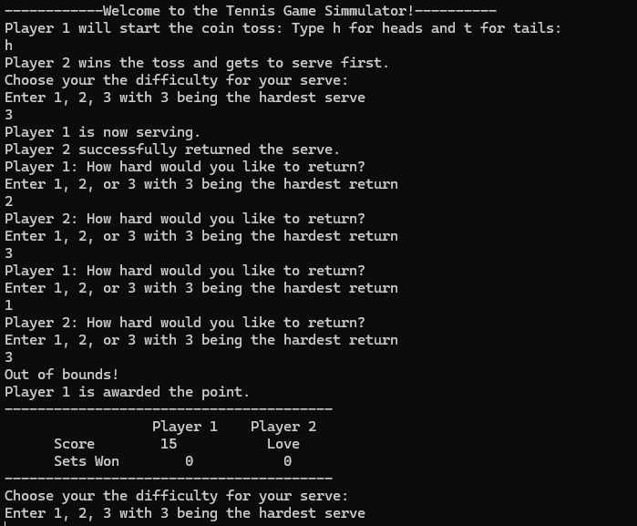
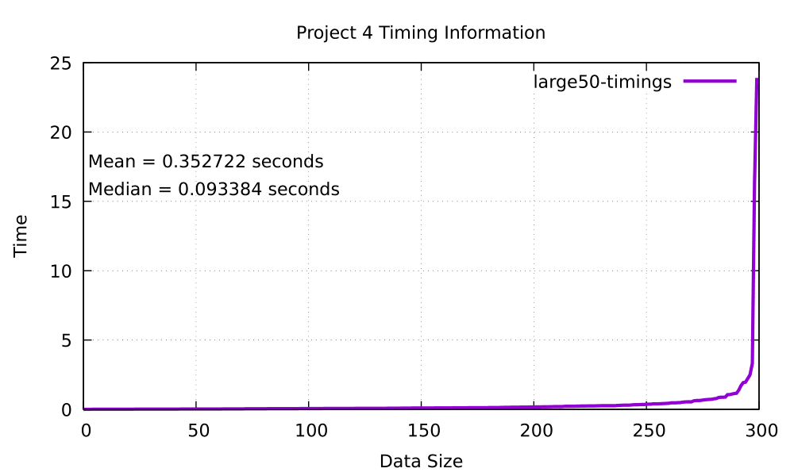
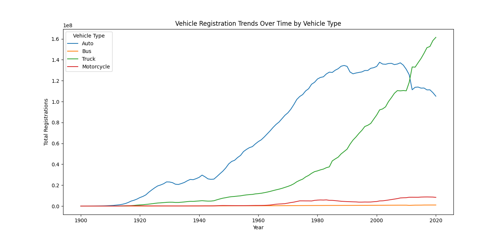
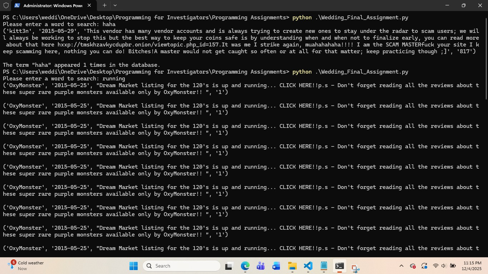

Portfolio
=========

Programming Projects
--------------------

*For access to my private project repositories, please [email me](mailto:weddingzack@gmail.com?subject=GitHub%20Access) with the subject line, GitHub Access.

---
### [Tennis Game](project1)

---
### [Overlap Coverage](project2)

---
### [Data Analysis and Visualization](project3)

---
### [Data Parser](project4)

---
Ethics Papers
-------------

### [Computer Architecture Ethics Paper](/pdf/Ethics Paper CA.pdf)

-   **Class:** Computer Architecture
-   **Grade:** A

### [Object-Oriented Ethics Paper](/pdf/Ethics Paper OOP.pdf)

-   **Class:** Object-Oriented Programming
-   **Grade:** A

### [Survey of Scripting Ethics Paper](/pdf/Ethics Paper Scripting.pdf)

-   **Class:** Survey of Scripting Languages
-   **Grade:** A

---

Presentations
-------------

### [Data Analysis and Visualization](/pdf/Data Analysis and Visualization Presentation.pdf)

- **Class:** Fundamentals of Artificial Intelligence
- **Grade:** A

### [Digital Forensics](/pdf/Digital Forensics Presentation.pdf)

- **Class:** Principles of Cybersecurity
- **Grade:** A

---

Page template forked from <a href="https://github.com/csu-cs/csci-portfolio">CSU-CS</a>

<!-- Remove above link if you don't want to attributive -->
