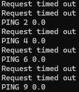
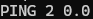

[Back to Portfolio](./)

UDP Pinger
===============

-   **Class:** CSCI 332
-   **Grade:** A
-   **Language(s):** Python
-   **Source Code Repository:** (Please [email me](mailto:weddingzack@gmail.com?subject=GitHub%20Access) to request access.)

## Project description

This project simulates a UDP-based pinger with both a server and client. The client sends a series of packets to the server, and the server is responsible for receiving these packets and responding. A UDP socket is created, and the server is assigned a specific IP address and port number. Packet loss is then simulated by random numbers. This project involves basic concepts of UDP communication, random packet loss simulation, and server-client interaction in network programming

## How to run the program

```bash
cd ./project
python3 server.py
python3 client.py
```

## UI Design

Almost every program requires user interaction, even command-line programs. Include in this section the tasks the user can complete and what the program does. You don't need to include how it works here; that information may go in the project description or in an additional section, depending on its significance.

First, ensure that that server.py program is running before the client.py server is running. If this does not happen, the program will not work.

The server.py program listens on the 127.0.0.1 IP address and 12000 port using a UDP socket. When the message from the client is recieved, the server generates a random number between 0 and 10 to simulate packet loss. If the number is less than 4, the server does not respond, thus "losing" the packet. If the random number is 4 or higher, the server sends the message back to the client.

The client.py program communicates with the server to measure the round-trip time for packets sent over a network. The client sends a series of "ping" messages to the server and waits for a response.

  
Fig 1. The whole message

  
Fig 2. Dropped packet

  
Fig 3. A packet that has not been dropped

For more details see [GitHub Flavored Markdown](https://guides.github.com/features/mastering-markdown/).

[Back to Portfolio](./)
