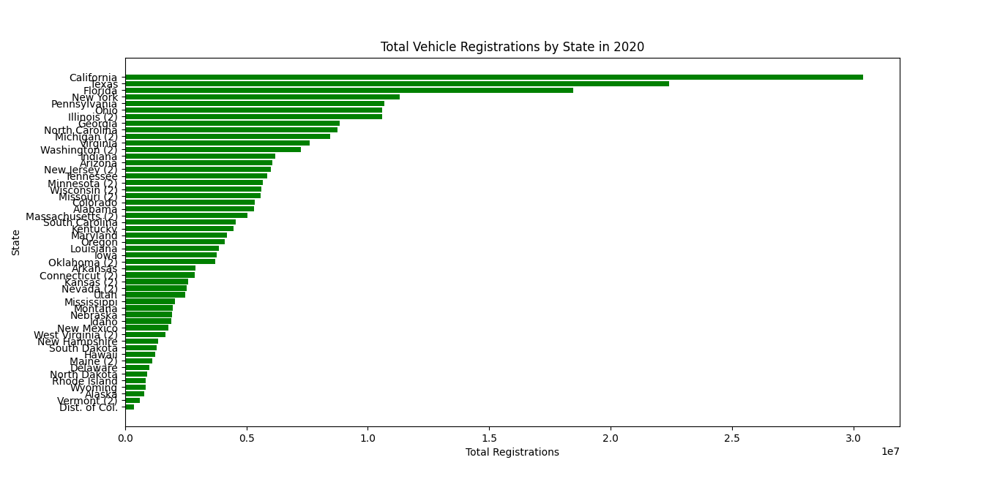
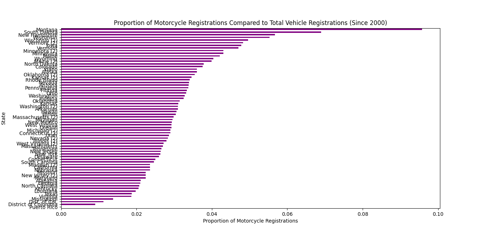
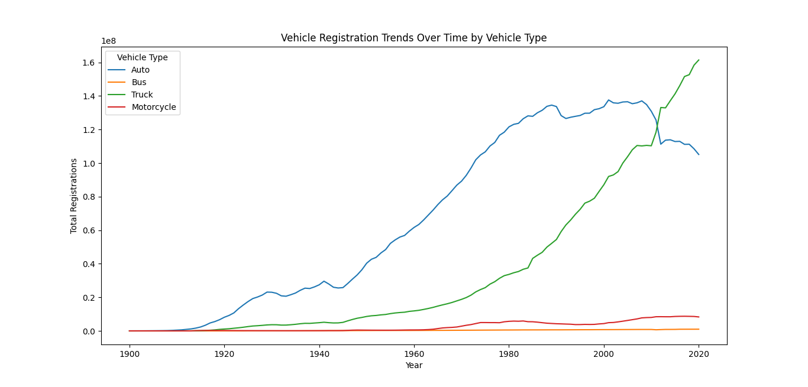

[Back to Portfolio](./)

Data Analysis and Visualization
===============

-   **Class:** CSCI 409
-   **Grade:** A
-   **Language(s):** Python
-   **Source Code Repository:** (Please [email me](mailto:weddingzack@gmail.com?subject=GitHub%20Access) to request access.)

## Project description

This project looks at data from three different angles. The data at hand is about vehicle registrations from 1900 to 2020. The data is separated by state and type of vehicle (auto, bus, truck, motorcycle). The angles that I decided to view the data from include the overall vehicle trends from 1900 to 2020, total vehicle registrations by state in 2020, and the proportion of motorcycle registrations by state from 2000 to 2020.

## How to run the program

```bash
cd ./project
python3 2020Registration.py
python3 MotorcycleProportions.py
python3 VehicleTrends.py
```

## UI Design

The programs first import the necessary libraries (pandas and matplotlib). Next, the programs load the dataset at hand (Motor_Vehicle_Registrations_Dashboard_data.csv). After this, the programs start to individualize.

The 2020Registration.py program then filters only 2020 data, adds the total number of registrations for each state, and displays these numbers on a horizontal bar graph.

The MotorcycleProportions.py program then filters only data from 2000 to 2020, calculates the total number of vehicle registrations by state, and then calculates the proportion of these registrations that are motorcycles. Finally, results are displayed on a horizontal bar graph.

The VehicleTrends.py program then sums the total number of vehicle registrations by vehicle every year and plots this number on a line graph.

  
Fig 1. 2020 registrations

  
Fig 2. Motorcycle proportions

  
Fig 3. Vehicle trends

For more details see [GitHub Flavored Markdown](https://guides.github.com/features/mastering-markdown/).

[Back to Portfolio](./)
