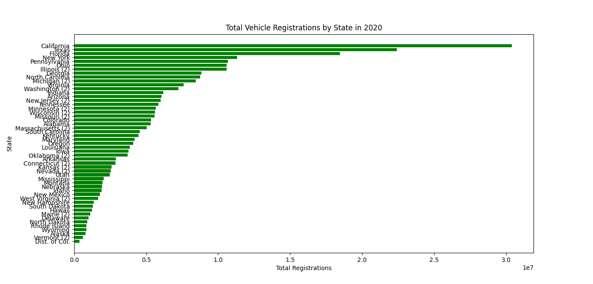
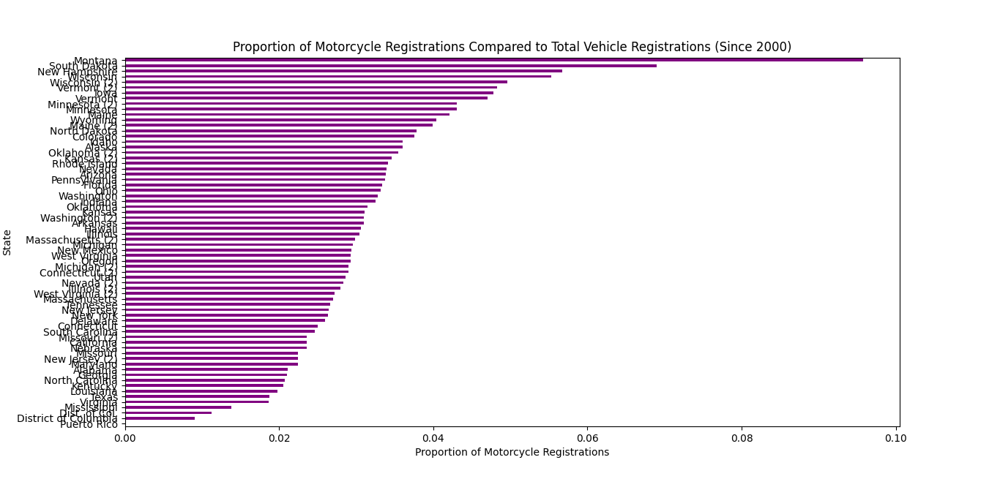

[Back to Portfolio](./)

Data Analysis and Visualization
===============

-   **Class:** Programming for Investigators
-   **Grade:** A
-   **Language(s):** Python
-   **Source Code Repository:** (Please [email me](mailto:weddingzack@gmail.com?subject=GitHub%20Access) to request access.)

## Project description

This project parses data from multiple HTML files and exports the data into a database for easy use. After exporting the data into a database, the user is prompted to enter a search term. If this term is found within the database, it prints out the row in which the term was found. In addition to this, the number of times that the search term was found in the database is printed.

## How to run the program

```bash
python .\Wedding_Final_Assignment.py
```

## UI Design

The programs first import the necessary libraries (pandas and matplotlib). Next, the programs load the dataset at hand (Motor_Vehicle_Registrations_Dashboard_data.csv). After this, the programs start to individualize.

The 2020Registration.py program then filters only 2020 data, adds the total number of registrations for each state, and displays these numbers on a horizontal bar graph.

The MotorcycleProportions.py program then filters only data from 2000 to 2020, calculates the total number of vehicle registrations by state, and then calculates the proportion of these registrations that are motorcycles. Finally, results are displayed on a horizontal bar graph.

The VehicleTrends.py program then sums the total number of vehicle registrations by vehicle every year and plots this number on a line graph.

  
Fig 1. 2020 registrations

  
Fig 2. Motorcycle proportions

  
Fig 3. Vehicle trends

For more details see [GitHub Flavored Markdown](https://guides.github.com/features/mastering-markdown/).

[Back to Portfolio](./)
